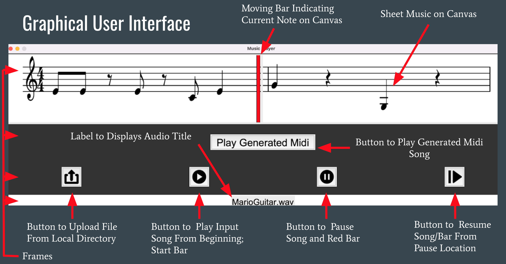

# SynMusic
_**A simple music transcriptor and reproducer**_

### Background: Representing Music Visually 
Although music is a sonic phenomena, there are multiple ways to suncintly depict it graphically. Sheet music is one of them and it allows to represent the arrangement of pitches over time in staff notation. Such notation uses an array of symbols and codes to precisely (but not necesarly intuitively) convey fundamental elements of a piece of music, namely, pitch, rythm , dynamics, and timbre.

## What You Need Before Using the Tool
#### 1. Install the Lily music engraving environment 
  * Lily Pond is a sheet music compiler and is needed to visually display music in our program. Follow the instructions on the [Lily Pond website](https://lilypond.org/download.html).
   * IMPORTANT: If you are using a Mac or PC, be sure to follow the instructions under "Running on the command-line". This is on the webpage after you select your operating system when downloading.
#### 2. Install the necesary external python packages, more information on their respective documenation websites (listed on Dependencies & Packages)
  * Package for communicating with the Lilypond application
    > pip install mingus
  * Tool and library for manipulating LilyPond files 
    > pip install python-ly
  * Package for pdf manipulation 
    > pip install pdf2image
  * Package for audio manipulation
    > pip install librosa
   
   For a complete list of all dependancies please check our reference section. 

## How it Works
### Signal Processing: Note Recognition and Music Transcription from an Audio File
#### Pitch and Octave range
 * To identify the pitch of the notes, we are taking a spectrogram of the audio sample. This will divide the signal into a set of time intervals, and will generate the frequency spectrum for each interval. We can then find the maximum magnitude and corresponding frequency for each time interval. Lastly, we can map these frequencies with a musical note.
 * Limitations:
   - Our tool only transcribes in treble clef notation.
   - Our tool can only identify single notes in the first 5 octaves. When trying to identify notes in the higher octaves, we were running into issues with harmonics. More advanced processing is required to analyze high-pitch notes and chords.
#### Rythmic Patterns
 * The time interval used for the spectrogram is set to the time legnth of a 1/8-note. Using a smaller time window lowers the resolution of the FFT, and makes it difficult to accurately identify notes.
 * When testing, we only used .wav files with a sampling rate of 44.1 kHz (standard for .wav files).
 * To identify when a note is played (versus when there is no note played), we compared the magnitude of each time interval to the maximum magnitude (loudest note) in the audio file. After testing, we settled on a threshold, in decibels, to determine if a note was being played in that interval.
 * We assumed that the tempo of the audio is 120 BPM. However, BPM input is a feasible feature that we could include in the GUI, if we'd like to upload music played at a different tempo.
 * Limitations:
   * The tool assumes that the musician only plays 1/8 notes. This is due to the difficulty in differentiating between sustained notes and double notes.
   * The tool is only writes music in 4/4 time signature. We have also optimized readability for 4/4. 
   - Readability Examples: If a rest comes after a note that is first or third in the measure, the tool will change the previous note from a 1/8 to a 1/4 note. If there two 1/8-rests to begin or end a measure, these will merge into one 1/4-rest. The music would still technically be accurate without edits like these, but it makes it much easier to understand for the user.

### MIDI Protocol
#### Talking to electric instruments
MIDI stands for Musical Instrument Digital Interface and is a standarized communication protocol that allows to play electric instruments. The most important thing to know when connecting a computer to another device is the port and the channel parameters. Port is the physical or virtual connection allowing for the serial bus communication between devices. Channel is the is the different lines of communication within a port connection. A port allows a badwidth of 16 channels to transmit independent commands to pottentiall 16 different external synthesizers. 
#### MIDI File vs MIDI Communication
MIDI could be easily thought as sequence of events to trigger particular sounds on a device. Thus, a MIDI file is just a way to store said sequence, and characteristics such as timbre are are specified by the device itself. The MIDI communication is the act of sending the trigers to the device in a way that is intellegible for it to capture and then create a sound. 

Our program allows to play an internal sound generator predefined by pygame.mixer. Hoever thise pygame module does not contain functionality to do MIDI communication from a MIDI file to an external device. Therefore, we implemented a non-standard MIDI sequence that is then translated into MIDI communication using functionalies from pygame.midi

## How to Use: Music Player GUI
Our goal was to create a GUI that can control the audio input and output (with play, pause, and resume buttons) and to display animated sheet music that highlights the notes while they are played.

### Music Player GUI Functionalities 
 
GUI contains load, play, pause, resume and 'play generated music' buttons.  
 * Load - Uploads and processes audio (.wav file) input. This opens a dialog box to select desired input audio wav file. Once file is selected, the tool converts it to sheet music and a MIDI file.  
 * Play - Plays the input audio file, while displaying the sheet music that shows the notes being played.  
 * Pause - Pauses input audio file.  
 * Resume - Resume input audio file.  
 * Play Generated Music - Plays output midi music file.
 * Play to External device - Midi communication with external synthesizer (midi player required for it to work)
 
 
 * Play External Device - Connects to a external synthesizer (PC has a preinstalled synthesizer device)
 * 
While connecting to external device please refer to the output console to specify the port and channel parameters. Yout will to specify the port to which your device appears and its channel (the channel can be preconfigured on your external devices).
 

For PC, refer to the image below if connecting to an internal synthesizer in the absence of an external device.  
 
 
## Repository Structure
 * Music_Player.py - Main script to run, produces a gui to convert audio input file to sheet music, midi file and midi communication. (Change directory in script to wav_to_sheet folder based on your local directory)
 * wav_to_sheet folder - contains all files required to run wav_to_sheet.py script, that is used by Music_Player.py scipt to produce sheet music
 * play_internal.py - Scipt to run output midi file using the pygame.mixer capabilities
 * play_external.py - Scipt to turn wav_to_sheet.py output into a midi sequence to share thorugh serial communication to an external device
 
## Dependancies and Packages:
Read Audio stream - SciPy.io  
Detect notes - SciPy.signal, numpy  
Convert to music notation - SciPy.signal, Lilypond, [mingus](https://bspaans.github.io/python-mingus/)  
Creating a user interface and file manipulation - [Tkinter](https://docs.python.org/3/library/tkinter.html), [Pygame](https://www.pygame.org/wiki/about), [Librosa](https://librosa.org/doc/latest/index.html), PIL, [pdf2image](https://pypi.org/project/pdf2image/)  
Communicating to external device - [Pygame.midi](https://www.pygame.org/docs/ref/midi.html)
 
##  References
- Music Engraving Program: [LilyPond](http://lilypond.org/doc/v2.22/Documentation/learning/simple-notation)
- Python Lyli Pond Object Format Package: [python-ly](https://pypi.org/project/python-ly/)
- Basic of the MIDI Protocol: [MIDI Tutorial](https://www.cs.cmu.edu/~music/cmsip/readings/MIDI%20tutorial%20for%20programmers.html) 
- Notes to Midi Note Mapping: [Midi Note Numbers and Center Frequencies](https://www.inspiredacoustics.com/en/MIDI_note_numbers_and_center_frequencies)

